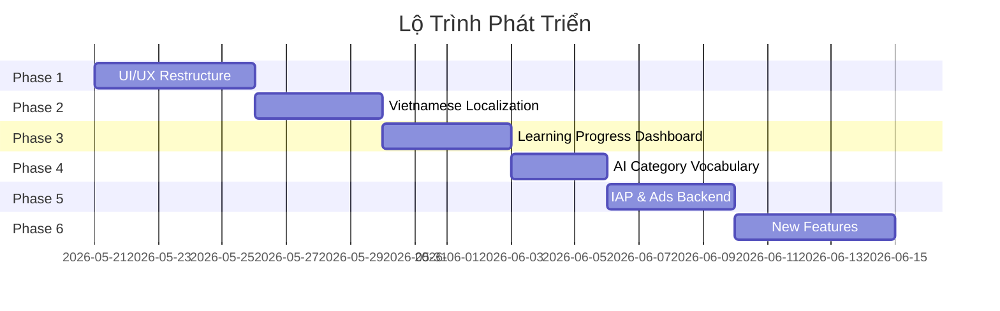

# English Practice App — Kế Hoạch Nâng Cấp Toàn Diện

## Tổng Quan

Kế hoạch nâng cấp app **English Practice** từ một app học từ vựng cơ bản thành một nền tảng học tiếng Anh toàn diện cho người Việt. Bao gồm 6 phase chính.

### Kiến trúc hiện tại (đã nghiên cứu)

| Layer | Tech |
|-------|------|
| **Backend** | Spring Boot 4.0.6 (Java 17) + MySQL + Hibernate |
| **Auth** | Firebase Auth (Bearer token → `FirebaseTokenFilter`) |
| **AI** | Google Vertex AI (Gemini 2.5 Flash Lite) |
| **Client** | Flutter + BLoC + Freezed + GoRouter |
| **Grammar** | 37 markdown files bundled trong `assets/md/grammar/` (LOCAL, không qua API) |
| **Vocabulary** | Oxford JSON files (~14MB trên server) + category JSON files (~12MB) |
| **IAP** | Client-side `in_app_purchase` package (không verify server) |
| **Ads** | `google_mobile_ads`: BannerAd + RewardedAd (đã implement) |



---

## User Review Required

> [!IMPORTANT]
> **Quyết định về ngôn ngữ mặc định**: App sẽ mặc định hiển thị tiếng Việt cho người dùng Việt Nam, với tùy chọn chuyển sang tiếng Anh trong Settings. Bạn có đồng ý hướng này không?

> [!IMPORTANT]
> **Cấu trúc navigation mới**: Đề xuất thay đổi thứ tự và nội dung 5 tab:
>
> | Tab cũ | Tab mới | Lý do |
> |--------|---------|-------|
> | Vocabulary | Vocabulary | Giữ nguyên, vẫn là core |
> | Studying (Review) | AI Lessons | AI là tính năng nổi bật, xứng đáng tab riêng |
> | AI | Progress (Dashboard) | Thay bằng Progress tracking — giá trị thực tiễn hơn |
> | Grammar | Grammar | Giữ nguyên |
> | Settings | Settings | Giữ nguyên |
>
> → Review/Flashcards truy cập từ nút trong Vocabulary hoặc Progress thay vì tab riêng.
>
> Bạn có đồng ý cách sắp xếp này không, hay muốn giữ nguyên cấu trúc cũ?

> [!WARNING]
> **IAP Backend Verification**: Hiện tại IAP chỉ xử lý client-side (không verify receipt trên server). Đề xuất thêm backend verification qua Spring Boot endpoint. Điều này yêu cầu thay đổi flow mua hàng hiện tại. Bạn có muốn thêm backend verification hay giữ client-side?

> [!IMPORTANT]
> **Grammar dịch sang tiếng Việt**: Grammar lessons hiện là 37 file `.md` nằm trong `assets/md/grammar/`. Để hỗ trợ song ngữ, có 2 cách:
> 1. **(Đề xuất) Tạo thêm folder `assets/md/grammar_vi/`** với bản dịch tiếng Việt cho mỗi file → nhanh, không cần backend
> 2. **Dịch tự động real-time** bằng AI khi user chọn tiếng Việt → chậm hơn, tốn quota AI
>
> Đề xuất dùng cách 1 cho chất lượng tốt và offline support. Bạn chọn cách nào?

## Open Questions

1. **Gói Premium hiện tại** chỉ bỏ ads + unlock full Oxford words? Hay có thêm tính năng khác?
2. **Bạn có muốn thêm gói subscription** (monthly/yearly) hay chỉ giữ one-time purchase?
3. **Interstitial Ads**: Hiện `CategoryScreen` đã dùng interstitial khi lesson scroll hết. Bạn muốn thêm vị trí nào khác?
4. **Grammar Lessons**: App có 37 lessons chia 4 categories. Bạn muốn thêm lessons mới hay tập trung dịch cái có trước?

---

## Phase 1: UI/UX Restructure — Tái cấu trúc giao diện

Mục tiêu: Nâng cấp UI hiện đại premium, sắp xếp lại navigation hợp lý hơn.

---

### 1.1 Bottom Navigation

#### [MODIFY] [home_navigation.dart](file:///C:/english_practice/english_practice_client/lib/ui/screens/home_navigation/home_navigation.dart)
- Thay đổi thứ tự tabs: **Vocabulary → AI → Progress → Grammar → Settings**
- Thay icon/label tab "Studying" → "AI" (icon `smart_toy`)
- Tab "AI" cũ → "Progress" (icon `insights`)
- Upgrade `BottomNavigationBar` → `NavigationBar` (Material 3) với:
  - Animated indicator
  - Rounded selected icon background
  - Label chỉ hiện khi chọn (giảm clutter)
- Cập nhật `routes`, `icons`, `labels` arrays

#### [MODIFY] [app_router.dart](file:///C:/english_practice/english_practice_client/lib/navigation/app_router.dart)
- Thêm route cho Progress screen: `/progress`
- Cập nhật thứ tự `StatefulShellBranch`
- Move Review/Flashcard routes vào Vocabulary branch (sub-route)

#### [MODIFY] [route_paths.dart](file:///C:/english_practice/english_practice_client/lib/navigation/route_paths.dart)
- Thêm `static const progress = '/progress'`

---

### 1.2 AI Lesson Screen (Nâng cấp tab AI)

#### [MODIFY] [ai_lesson_screen.dart](file:///C:/english_practice/english_practice_client/lib/ui/screens/ai_lesson/ai_lesson_screen.dart)
- Redesign từ empty state đơn giản → Dashboard AI lessons:
  - **Hero Section**: Gradient card với lời chào + AI illustration
  - **Quick Actions Row**: Nút "New Lesson" + "Browse Topics"
  - **Category Grid**: Hiển thị 18 categories dưới dạng grid cards 2×3 (scrollable)
  - **Recent Lessons**: Hiển thị 3 bài gần nhất nếu có
- Thêm skeleton loading

#### [MODIFY] [select_topic_screen.dart](file:///C:/english_practice/english_practice_client/lib/ui/screens/ai_lesson/select_topic_screen.dart)
- Chuyển categories từ `ListView` → `GridView` 2 cột
- Thêm animation khi chọn category

---

### 1.3 Vocabulary Screen cải thiện

#### [MODIFY] [vocabulary_screen.dart](file:///C:/english_practice/english_practice_client/lib/ui/screens/vocabulary/vocabulary_screen.dart)
- Thêm **stats bar** trên cùng: tổng từ / starred / mastered
- Thêm **CEFR level filter** chips (A1→C2) bên cạnh filter hiện tại
- Thêm nút **"Start Review"** nổi bật khi có từ starred cần review
- Thêm debounce cho search

#### [MODIFY] [vocabulary_item.dart](file:///C:/english_practice/english_practice_client/lib/ui/screens/vocabulary/widgets/vocabulary_item.dart)
- Thêm Vietnamese meaning dưới definition (khi locale = vi)
- Hiển thị SRS level indicator nhỏ (dot: new/learning/mastered)

---

### 1.4 Theme & Design System

#### [MODIFY] [app.dart](file:///C:/english_practice/english_practice_client/lib/app.dart)
- Thêm Google Fonts (Inter hoặc Outfit)
- Cải thiện `ColorScheme`:
  - Surface tones tinh tế hơn
  - Custom `CardTheme` với rounded corners + subtle shadows
  - Custom `AppBarTheme` (transparent, no elevation)
  - Custom `InputDecorationTheme` (rounded, outlined)
- Nâng cấp typography scale

#### [MODIFY] [pubspec.yaml](file:///C:/english_practice/english_practice_client/pubspec.yaml)
- Thêm `google_fonts` package

---

## Phase 2: Vietnamese Localization — Việt hóa App

Mục tiêu: Song ngữ Việt-Anh cho toàn bộ UI + grammar content.

---

### 2.1 Localization Infrastructure

#### [NEW] `lib/l10n/app_en.arb` 
- Extract tất cả ~150-200 hardcoded English strings từ UI

#### [NEW] `lib/l10n/app_vi.arb`
- Bản dịch tiếng Việt, ví dụ:
```json
{
  "vocabulary": "Từ vựng",
  "grammar": "Ngữ pháp",
  "settings": "Cài đặt",
  "aiLessons": "Bài học AI",
  "progress": "Tiến trình",
  "startFlashcards": "Bắt đầu Flashcard",
  "streak": "Chuỗi ngày học",
  "keepUpTheGoodWork": "Tiếp tục phát huy nhé!",
  "searchWords": "Tìm kiếm từ vựng...",
  "noLessonsYet": "Chưa có bài học nào.",
  "createNewLesson": "Tạo bài học mới",
  "wordCount": "Số từ: {count}",
  "masteredWords": "Đã thuộc",
  "learningWords": "Đang học"
}
```

#### [NEW] `l10n.yaml`
```yaml
arb-dir: lib/l10n
template-arb-file: app_en.arb
output-localization-file: app_localizations.dart
```

#### [MODIFY] [app.dart](file:///C:/english_practice/english_practice_client/lib/app.dart)
- Thêm `localizationsDelegates` và `supportedLocales`
- Bind `locale` với `SettingsBloc.locale`

#### [MODIFY] [pubspec.yaml](file:///C:/english_practice/english_practice_client/pubspec.yaml)
- Thêm `flutter_localizations` SDK dependency
- Thêm `generate: true`

#### [MODIFY] Toàn bộ screens
- Replace hardcoded strings → `AppLocalizations.of(context)!.xxx`
- Ước tính ảnh hưởng ~20 files

---

### 2.2 Grammar Content Song Ngữ

> [!NOTE]
> Grammar hiện là 37 file `.md` bundled trong `assets/md/grammar/` (loaded bằng `rootBundle.loadString`), không qua backend API.

#### [NEW] `assets/md/grammar_vi/` — toàn bộ structure mirror `assets/md/grammar/`
- 37 file `.md` dịch sang tiếng Việt
- Giữ cùng cấu trúc file name cho dễ mapping
- Dịch bằng AI (Gemini) + review thủ công
- Format: giữ nguyên markdown structure, dịch nội dung

Cấu trúc:
```
assets/md/grammar_vi/
├── grammar.md
├── idioms.md
├── phrasal__verbs.md
├── proverbs.md
├── quantifiers.md
├── sentences/
│   ├── comparison__sentences.md
│   ├── conditional__sentences.md
│   └── ... (8 files)
├── tenses/
│   ├── present/ (4 files)
│   ├── past/ (4 files)
│   └── future/ (5 files)
└── words/
    ├── article.md
    ├── conjunction.md
    └── ... (7 files + word_families/)
```

#### [MODIFY] [grammar_screen.dart](file:///C:/english_practice/english_practice_client/lib/ui/screens/grammar/grammar_screen.dart)
- Cập nhật `CategoryData` list:
  - Thêm `titleVi`, `descriptionVi` cho mỗi category
  - Thêm `pathVi` cho mỗi `Lesson` (trỏ đến `assets/md/grammar_vi/xxx.md`)
- Hiển thị title theo locale hiện tại

#### [MODIFY] [lesson_screen.dart](file:///C:/english_practice/english_practice_client/lib/ui/screens/grammar/lesson_screen.dart)
- Load markdown file theo locale: `grammar/` hoặc `grammar_vi/`
- Thêm **toggle button EN/VI** trên AppBar để chuyển đổi nhanh
- (Optional) Split view EN | VI song song

#### [MODIFY] `lib/data/models/lesson.dart`
- Thêm field `pathVi` cho đường dẫn file tiếng Việt

#### [MODIFY] `lib/generated/assets.dart`
- Regenerate để include các file `grammar_vi/`

#### [NEW] Script: `scripts/translate_grammar.dart`
- Dart script dùng Gemini API để dịch batch 37 file `.md`
- Input: `assets/md/grammar/*.md`
- Output: `assets/md/grammar_vi/*.md`
- Giữ nguyên markdown formatting, chỉ dịch nội dung text

---

### 2.3 Settings: Language Picker

#### [MODIFY] [settings_screen.dart](file:///C:/english_practice/english_practice_client/lib/ui/screens/settings/settings_screen.dart)
- Thêm section **"Ngôn ngữ / Language"** sau Theme:
  - Tile với flag icon 🇻🇳/🇬🇧
  - Tap → chọn ngôn ngữ
- Lưu vào `SharedPreferences`

#### [MODIFY] `settings_bloc.dart` / `settings_state.dart` / `settings_event.dart`
- Thêm `String locale` vào state (mặc định `'vi'`)
- Thêm event `changeLocale(String locale)`
- Persist trong `SettingsSnapshot`

---

## Phase 3: Learning Progress Dashboard — Bảng theo dõi tiến trình

Mục tiêu: User thấy rõ progress, tạo động lực học tiếp.

---

### 3.1 Progress Screen (Tab mới)

#### [NEW] `lib/ui/screens/progress/progress_screen.dart`
- **Header Card**: Streak hiện tại + circular timer (thời gian học hôm nay / 5 phút goal)
- **Vocabulary Stats Card**:
  - Total words / Unknown / Starred / Mastered
  - Horizontal progress bars theo status
  - CEFR level breakdown (mini pie chart)
- **Grammar Progress Card**:
  - X/37 lessons completed (progress ring)
  - Categories breakdown
- **AI Lessons Stats Card**:
  - Tổng lessons đã tạo
  - Từ vựng đã học từ AI
- **Weekly Activity Bar Chart**:
  - 7 ngày gần nhất, mỗi bar = thời gian học
- **Streak Calendar**:
  - Heatmap style (giống GitHub contributions)
  - Tháng hiện tại

#### [NEW] `lib/ui/screens/progress/bloc/progress_bloc.dart`
#### [NEW] `lib/ui/screens/progress/bloc/progress_event.dart`  
#### [NEW] `lib/ui/screens/progress/bloc/progress_state.dart`
- State: `VocabStats`, `GrammarStats`, `WeeklyActivity[]`, `StreakCalendar`
- Events: `loadProgress`, `refreshProgress`
- Data sources: aggregate từ `VocabularyBloc`, `LessonBloc` (grammar marks), `StreakBloc`

#### [NEW] `lib/ui/screens/progress/widgets/stats_card.dart`
- Reusable card với title, icon, value, progress bar

#### [NEW] `lib/ui/screens/progress/widgets/weekly_chart.dart`
- Simple bar chart widget (dùng `CustomPainter` hoặc `fl_chart` package)

#### [NEW] `lib/ui/screens/progress/widgets/streak_calendar.dart`
- Calendar heatmap widget (dùng `TableCalendar` hoặc custom)

---

### 3.2 Backend: Study History Tracking

#### [NEW] Backend: `src/entity/StudySession.java`
```java
@Entity
public class StudySession {
    @Id @GeneratedValue
    private Long id;
    
    @ManyToOne
    private User user;
    
    private LocalDate date;
    private Integer timeSpentSeconds;
    private Integer wordsLearned;
    private Integer lessonsCompleted;
    private LocalDateTime createdAt;
}
```

#### [NEW] Backend: `src/repository/StudySessionRepository.java`

#### [NEW] Backend: `src/controller/ProgressController.java`

| Method | Path | Description |
|--------|------|-------------|
| GET | `/api/v1/progress/summary` | Tổng hợp stats |
| GET | `/api/v1/progress/weekly` | Activity 7 ngày gần nhất |
| GET | `/api/v1/progress/calendar?month=` | Streak calendar cho tháng |
| POST | `/api/v1/progress/log-session` | Client log study session |

#### [NEW] Backend: `src/service/ProgressService.java` + `impl/ProgressServiceImpl.java`

#### Client: [NEW] `lib/data/datasources/progress_remote_data_source.dart`
#### Client: [NEW] `lib/data/repositories/progress_repository.dart`
#### Client: [NEW] `lib/data/models/progress_summary.dart`
#### Client: [NEW] `lib/data/models/study_session.dart`

---

### 3.3 Vocabulary Progress Enhancement

#### [MODIFY] Backend: `UserVocabulary.java` entity
- Thêm fields:
```java
private Integer reviewCount = 0;
private LocalDateTime lastReviewedAt;
private LocalDateTime learnedAt; // lần đầu thêm
private LocalDateTime masteredAt; // khi master
```

#### [MODIFY] Backend: `VocabularyServiceImpl.java`
- Cập nhật sync logic để track `reviewCount`, `lastReviewedAt`
- Thêm method `getVocabularyStats(User user)` → return summary counts

---

## Phase 4: AI Category Vocabulary — Học từ theo chủ đề AI

Mục tiêu: Tận dụng 18 AI categories + category JSON files để tạo hệ thống học có tổ chức.

---

### 4.1 Category-based Vocabulary Browser

#### [NEW] `lib/ui/screens/ai_lesson/category_words_screen.dart`
- Hiển thị danh sách từ vựng trong 1 category (từ server JSON)
- Filter theo CEFR level (A1-C2)
- Mỗi từ: word, phonetic, definition, example, status (learned/not)
- Nút "Add to My Words" / "Remove"
- Nút "Generate Lesson" → tạo AI lesson từ category đó

#### Backend: [NEW] `src/controller/CategoryVocabularyController.java`

| Method | Path | Description |
|--------|------|-------------|
| GET | `/api/v1/categories` | List 18 categories + word counts |
| GET | `/api/v1/categories/{id}/words?level=` | Words trong category, filter by level |

#### Backend: [NEW] `src/service/CategoryVocabularyService.java`
- Load từ `json/category_words/` files
- Filter by level, paginate

#### Client: [NEW] `lib/data/datasources/category_remote_data_source.dart`
#### Client: [NEW] `lib/data/repositories/category_repository.dart`

---

### 4.2 Smart Word Suggestions

#### [MODIFY] [ai_lesson_detail_screen.dart](file:///C:/english_practice/english_practice_client/lib/ui/screens/ai_lesson/ai_lesson_detail_screen.dart)
- Thêm nút **"Save All to Vocabulary"** batch save
- Hiển thị badge nếu từ đã có trong vocabulary

#### Backend: [NEW] endpoint `GET /api/v1/ai/suggested-words?category=&level=`
- Dựa trên từ user đã học trong category, gợi ý từ mới cùng category + level
- Từ data từ category JSON files, exclude đã learned

---

## Phase 5: IAP & Ads Backend — Hoàn thiện mua hàng & quảng cáo

Mục tiêu: Server-side verification cho IAP, optimize ads.

---

### 5.1 Backend: Purchase Verification

#### [NEW] Backend: `src/entity/Purchase.java`
```java
@Entity
public class Purchase {
    @Id @GeneratedValue
    private Long id;
    
    @ManyToOne
    private User user;
    
    private String productId;
    private String platform; // android / ios
    private String purchaseToken;
    private LocalDateTime purchaseDate;
    private LocalDateTime expiryDate; // for subscriptions
    private String status; // active / expired / refunded
}
```

#### [NEW] Backend: `src/repository/PurchaseRepository.java`
#### [NEW] Backend: `src/controller/PurchaseController.java`

| Method | Path | Description |
|--------|------|-------------|
| POST | `/api/v1/purchases/verify` | Verify purchase receipt |
| GET | `/api/v1/purchases/status` | Check subscription status |

#### [NEW] Backend: `src/service/PurchaseService.java` + `impl/PurchaseServiceImpl.java`
- Verify receipt với Google Play Developer API
- Verify receipt với App Store Server API
- Lưu purchase record

#### [MODIFY] Backend: `build.gradle.kts`
- Thêm `com.google.apis:google-api-services-androidpublisher` dependency

---

### 5.2 Client: IAP improvements

#### [MODIFY] [iap_bloc.dart](file:///C:/english_practice/english_practice_client/lib/ui/blocs/iap/iap_bloc.dart)
- Sau purchase thành công → gọi `POST /api/v1/purchases/verify`
- Fallback: nếu verify fail, vẫn hoạt động client-side

#### [MODIFY] [paywall_dialog.dart](file:///C:/english_practice/english_practice_client/lib/ui/commons/dialogs/paywall_dialog.dart)
- Redesign UI:
  - Feature comparison table (Free vs Premium)
  - Animated gradient background
  - Trial period highlight
  - Testimonials/social proof

---

### 5.3 Ads Optimization

#### [NEW] `lib/ui/commons/ads/native_ad_widget.dart`
- Native ad blends vào vocabulary list (mỗi 10 items)
- Styling match với app theme

#### [MODIFY] Existing `banner_ad_widget.dart`
- Improve loading state (shimmer thay vì blank)
- Better error handling

---

### 5.4 Premium Features (đề xuất)

| Feature | Free | Premium |
|---------|------|---------|
| Oxford Words | 3000 | 6000 |
| AI Lessons | 3/ngày | Unlimited |
| AI Word Limit | 300 words input | 1000 words |
| Flashcard Reviews | 1 free session/ngày (sau đó xem ad) | Unlimited |
| Grammar Lessons | 3 free/category (sau đó xem ad) | All |
| Ads | Banner + Rewarded | Không ads |
| Progress Dashboard | Basic stats | Full analytics + charts |
| Offline Mode | ❌ | ✅ |
| Grammar Quiz | ❌ | ✅ |

---

## Phase 6: Practical New Features — Tính năng mới thực tiễn

---

### 6.1 Word of the Day 🌟

#### [NEW] `lib/ui/screens/home_navigation/widget/word_of_day_card.dart`
- Card đẹp hiển thị trên đầu Vocabulary screen
- Random từ Oxford phù hợp level user (chưa học)
- Phát âm, nghĩa tiếng Việt, ví dụ
- Nút "Add to Review" / swipe dismiss

#### Backend: [NEW] `GET /api/v1/vocabulary/word-of-day?level=`
- Random word từ Oxford JSON, exclude đã learned
- Cache 1 ngày per user

---

### 6.2 Pronunciation Practice 🔊

#### [NEW] `lib/ui/screens/vocabulary/widgets/pronunciation_widget.dart`
- Text-to-Speech cho mỗi từ vựng
- Toggle UK 🇬🇧 / US 🇺🇸 accent
- Nút play trên `VocabularyItem` và `WordDetailsScreen`

#### [MODIFY] [pubspec.yaml](file:///C:/english_practice/english_practice_client/pubspec.yaml)
- Thêm `flutter_tts` package

#### [MODIFY] [word_details_screen.dart](file:///C:/english_practice/english_practice_client/lib/ui/screens/vocabulary/word_details_screen.dart)
- Tích hợp pronunciation widget

---

### 6.3 Grammar Quiz 📝

#### [NEW] `lib/ui/screens/grammar/quiz_screen.dart`
- Sau mỗi grammar lesson → nút "Take Quiz"
- Các dạng câu hỏi:
  - Fill-in-the-blank
  - Multiple choice (4 options)
  - True/False
- 5-10 câu per quiz
- Hiển thị kết quả + giải thích
- Lưu score vào progress

#### Backend: [NEW] `GET /api/v1/ai/grammar-quiz?topic=&level=`
- Dùng Vertex AI (Gemini) generate quiz từ nội dung lesson
- Cache quiz per lesson

#### [NEW] Backend: `src/controller/QuizController.java`
#### [NEW] Backend: `src/service/QuizService.java`

---

### 6.4 Bookmark Grammar Lessons ❤️

#### [MODIFY] [lesson_screen.dart](file:///C:/english_practice/english_practice_client/lib/ui/screens/grammar/lesson_screen.dart)
- Thêm nút bookmark ❤️ trên AppBar (bên cạnh checkbox mark-as-read)
- Lưu local (SharedPreferences / Hive)

#### [MODIFY] [grammar_screen.dart](file:///C:/english_practice/english_practice_client/lib/ui/screens/grammar/grammar_screen.dart)
- Thêm section "Bookmarked Lessons" trên cùng
- Quick access đến lessons đã bookmark

#### [MODIFY] `lesson_bloc.dart`
- Thêm event `bookmarkLesson` / `unbookmarkLesson`
- Thêm `Set<int> bookmarkedLessons` vào state

---

### 6.5 Daily Goal & Smart Reminder ⏰

#### [NEW] `lib/ui/screens/settings/widgets/daily_goal_picker.dart`
- Cho user đặt mục tiêu: 5 / 10 / 15 / 20 / 30 phút/ngày
- Hiển thị progress trên Progress dashboard
- Circular progress indicator trên home

#### [MODIFY] `notifications_bloc.dart`
- Thêm scheduled notification nhắc nhở học theo giờ user chọn
- Smart reminder: nếu chưa đạt goal hôm nay → nhắc vào tối

#### [MODIFY] Backend: `UserSetting.java`
- `dailyGoal` đã có (default 10) → expose qua Settings UI

---

### 6.6 Share Progress Card 📤

#### [MODIFY] [streak_screen.dart](file:///C:/english_practice/english_practice_client/lib/ui/screens/streak/streak_screen.dart)
- Nâng cấp share feature:
  - Generate ảnh progress card đẹp (dùng `RepaintBoundary` → screenshot)
  - Hiển thị: streak, số từ đã học, level, avatar
  - Share kèm ảnh

---

### 6.7 Offline Mode (Premium) 📴

#### [NEW] `lib/data/datasources/local/vocabulary_local_data_source.dart`
#### [NEW] `lib/data/datasources/local/ai_lesson_local_data_source.dart`
- Cache vocabulary data và AI lessons vào local storage
- Sync khi có internet

#### [MODIFY] [pubspec.yaml](file:///C:/english_practice/english_practice_client/pubspec.yaml)
- Thêm `hive` + `hive_flutter` cho local storage

#### [MODIFY] Repository classes
- Thêm offline-first pattern: check local → fallback remote → cache result

---

## Tổng kết File Changes

### Backend (`english_practice_backend/src/main/java/...`)

| Action | File | Phase |
|--------|------|-------|
| NEW | `entity/StudySession.java` | 3 |
| NEW | `entity/Purchase.java` | 5 |
| NEW | `repository/StudySessionRepository.java` | 3 |
| NEW | `repository/PurchaseRepository.java` | 5 |
| NEW | `controller/ProgressController.java` | 3 |
| NEW | `controller/CategoryVocabularyController.java` | 4 |
| NEW | `controller/PurchaseController.java` | 5 |
| NEW | `controller/QuizController.java` | 6 |
| NEW | `service/ProgressService.java` + impl | 3 |
| NEW | `service/CategoryVocabularyService.java` | 4 |
| NEW | `service/PurchaseService.java` + impl | 5 |
| NEW | `service/QuizService.java` | 6 |
| MODIFY | `entity/UserVocabulary.java` | 3 |
| MODIFY | `service/impl/VocabularyServiceImpl.java` | 3 |
| MODIFY | `build.gradle.kts` | 5 |
| MODIFY | `config/SecurityConfig.java` | 3, 4, 5 |

### Client (`english_practice_client/lib/`)

| Action | File | Phase |
|--------|------|-------|
| NEW | `l10n/app_en.arb` | 2 |
| NEW | `l10n/app_vi.arb` | 2 |
| NEW | `l10n.yaml` | 2 |
| NEW | `assets/md/grammar_vi/` (37 files) | 2 |
| NEW | `ui/screens/progress/progress_screen.dart` | 3 |
| NEW | `ui/screens/progress/bloc/*` (3 files) | 3 |
| NEW | `ui/screens/progress/widgets/*` (3 files) | 3 |
| NEW | `data/datasources/progress_remote_data_source.dart` | 3 |
| NEW | `data/repositories/progress_repository.dart` | 3 |
| NEW | `data/models/progress_summary.dart` | 3 |
| NEW | `data/models/study_session.dart` | 3 |
| NEW | `ui/screens/ai_lesson/category_words_screen.dart` | 4 |
| NEW | `data/datasources/category_remote_data_source.dart` | 4 |
| NEW | `data/repositories/category_repository.dart` | 4 |
| NEW | `ui/commons/ads/native_ad_widget.dart` | 5 |
| NEW | `ui/screens/home_navigation/widget/word_of_day_card.dart` | 6 |
| NEW | `ui/screens/vocabulary/widgets/pronunciation_widget.dart` | 6 |
| NEW | `ui/screens/grammar/quiz_screen.dart` | 6 |
| NEW | `ui/screens/settings/widgets/daily_goal_picker.dart` | 6 |
| NEW | `data/datasources/local/*` (2 files) | 6 |
| NEW | `scripts/translate_grammar.dart` | 2 |
| MODIFY | `ui/screens/home_navigation/home_navigation.dart` | 1 |
| MODIFY | `navigation/app_router.dart` | 1, 3 |
| MODIFY | `navigation/route_paths.dart` | 1 |
| MODIFY | `ui/screens/ai_lesson/ai_lesson_screen.dart` | 1 |
| MODIFY | `ui/screens/ai_lesson/select_topic_screen.dart` | 1 |
| MODIFY | `ui/screens/vocabulary/vocabulary_screen.dart` | 1, 6 |
| MODIFY | `ui/screens/vocabulary/widgets/vocabulary_item.dart` | 1 |
| MODIFY | `ui/screens/vocabulary/word_details_screen.dart` | 6 |
| MODIFY | `app.dart` | 1, 2 |
| MODIFY | `pubspec.yaml` | 1, 2, 6 |
| MODIFY | `ui/screens/settings/settings_screen.dart` | 2 |
| MODIFY | `ui/screens/settings/bloc/*` (3 files) | 2 |
| MODIFY | `ui/screens/grammar/grammar_screen.dart` | 2, 6 |
| MODIFY | `ui/screens/grammar/lesson_screen.dart` | 2, 6 |
| MODIFY | `ui/screens/grammar/bloc/lesson_bloc.dart` | 6 |
| MODIFY | `data/models/lesson.dart` | 2 |
| MODIFY | `generated/assets.dart` | 2 (auto) |
| MODIFY | `ui/screens/ai_lesson/ai_lesson_detail_screen.dart` | 4 |
| MODIFY | `ui/blocs/iap/iap_bloc.dart` | 5 |
| MODIFY | `ui/commons/dialogs/paywall_dialog.dart` | 5 |
| MODIFY | `ui/commons/ads/banner_ad_widget.dart` | 5 |
| MODIFY | `ui/screens/streak/streak_screen.dart` | 6 |
| MODIFY | `ui/screens/notifications/bloc/notifications_bloc.dart` | 6 |
| MODIFY | `configs/di.dart` | 3, 4, 5, 6 |

---

## Verification Plan

### Build & Test
```bash
# Backend
cd english_practice_backend
./gradlew build
./gradlew test

# Flutter
cd english_practice_client
flutter analyze
flutter test
flutter build apk --debug
```

### Manual Verification Checklist
- [ ] Chuyển đổi ngôn ngữ EN ↔ VI trên tất cả screens
- [ ] Grammar lessons hiển thị đúng tiếng Việt, toggle EN/VI hoạt động
- [ ] Progress dashboard hiển thị đúng data từ vocabulary + grammar
- [ ] AI lesson generation + category browsing hoạt động
- [ ] IAP flow: mua → verify → unlock features
- [ ] Ads hiển thị đúng vị trí, Premium user không thấy ads
- [ ] Navigation mới 5 tab hoạt động smooth
- [ ] Dark mode tương thích tất cả screens mới
- [ ] Responsive trên nhiều screen sizes
- [ ] Offline mode (Premium): cache data, hoạt động không internet
